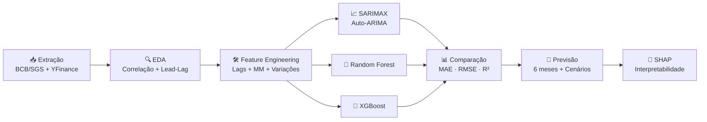

# 📊 Selic Forecast — Previsão da Taxa de Juros Selic

<div align="center">

[](https://python.org)
[](https://jupyter.org)
[](https://scikit-learn.org)
[](https://xgboost.readthedocs.io)
[](LICENSE)

*Pipeline completo de extração, análise exploratória e modelagem preditiva da taxa de juros Selic do Brasil*

</div>

---

## 🎯 Sobre o Projeto

A **Taxa Selic** é a taxa básica de juros da economia brasileira, definida pelo COPOM (Comitê de Política Monetária) do Banco Central. Este projeto constrói um pipeline de ciência de dados para **prever a Selic 6 meses à frente** usando indicadores macroeconômicos e modelos de Machine Learning.

### O que este projeto faz:

- 📥 **Extrai dados automaticamente** do Banco Central (API SGS) e Yahoo Finance
- 🔍 **Análise exploratória completa** — correlações, defasagens, decomposição temporal
- 🛠️ **Feature engineering** — lags, médias móveis, variações, indicadores de ciclo
- 📈 **3 modelos preditivos** — SARIMAX, Random Forest e XGBoost
- 🧠 **Interpretabilidade** — SHAP values para entender os drivers da previsão
- 🔮 **Projeção futura** com cenários (otimista / base / pessimista)

---

## 📈 Indicadores Macroeconômicos

| Categoria | Indicador | Fonte | Código SGS |
|-----------|-----------|-------|------------|
| **Target** | Taxa Selic Meta (% a.a.) | BCB/SGS | 4189 |
| **Inflação** | IPCA mensal (%) | BCB/SGS | 433 |
| **Inflação** | IPCA acumulado 12m (%) | BCB/SGS | 13522 |
| **Inflação** | IGP-M mensal (%) | BCB/SGS | 189 |
| **Câmbio** | USD/BRL (venda) | BCB/SGS | 3698 |
| **Fiscal** | Dívida Líquida / PIB (%) | BCB/SGS | 4513 |
| **Fiscal** | Resultado Primário / PIB (%) | BCB/SGS | 4505 |
| **Atividade** | Desemprego PNAD (%) | BCB/SGS | 24369 |
| **Atividade** | Produção Industrial (%) | BCB/SGS | 21859 |
| **Externo** | Petróleo Brent (USD) | Yahoo Finance | BZ=F |
| **Externo** | Dollar Index DXY | Yahoo Finance | DX-Y.NYB |

---

## 🛠️ Stack Tecnológica

| Categoria | Tecnologias |
|-----------|-------------|
| **Dados** | `python-bcb` · `yfinance` · `pandas` · `numpy` |
| **Visualização** | `plotly` · `matplotlib` · `seaborn` |
| **Séries Temporais** | `statsmodels` · `pmdarima` (Auto-ARIMA) |
| **Machine Learning** | `scikit-learn` · `xgboost` |
| **Interpretabilidade** | `shap` |

---

## 📂 Estrutura do Projeto

```
selic-forecast/
├── 📄 README.md
├── 📄 requirements.txt
├── 📄 .gitignore
└── 📁 notebooks/
    └── 📓 selic_forecast.ipynb   ← Notebook principal (autocontido)
```

---

## 🚀 Como Executar

### 1. Clone o repositório

```bash
git clone https://github.com/KaiquePinhworker/selic-forecast.git
cd selic-forecast
```

### 2. Crie um ambiente virtual

```bash
python -m venv venv
source venv/bin/activate  # Linux/Mac
# venv\Scripts\activate   # Windows
```

### 3. Instale as dependências

```bash
pip install -r requirements.txt
```

### 4. Execute o notebook

```bash
jupyter notebook notebooks/selic_forecast.ipynb
```

> 💡 **Alternativa**: A primeira célula do notebook instala todas as dependências automaticamente via `pip install`.

---

## 📖 Metodologia



### Etapas detalhadas:

1. **Extração** — Coleta automatizada de 11 indicadores via APIs oficiais
2. **EDA** — Análise de correlações, defasagens temporais (lead-lag) e decomposição STL
3. **Feature Engineering** — Lags (1, 3, 6 meses), médias móveis, variações MoM/YoY, features de ciclo monetário
4. **Modelagem** — SARIMAX com Auto-ARIMA + Random Forest + XGBoost
5. **Validação** — `TimeSeriesSplit` (4 folds) — nunca K-Fold aleatório em séries temporais
6. **Interpretabilidade** — SHAP values para entender quais indicadores mais influenciam a previsão
7. **Previsão** — Projeção 6 meses à frente com banda de confiança ±0.5 p.p.

---

## 📊 Avaliação

Os modelos são comparados usando validação temporal com as métricas:

| Métrica | Descrição |
|---------|-----------|
| **MAE** | Erro Absoluto Médio (em pontos percentuais) |
| **RMSE** | Raiz do Erro Quadrático Médio |
| **MAPE** | Erro Percentual Absoluto Médio |
| **R²** | Coeficiente de Determinação |

---

## 🧠 Principais Insights

- **Inflação é o principal driver** — IPCA acumulado 12m lidera a importância em todos os modelos
- **Defasagem de 1-3 meses** — Indicadores macro "lideram" as decisões do COPOM
- **SHAP confirma a teoria** — Features relevantes são consistentes com os fundamentos da política monetária

---

## 📝 Limitações

- A Selic é definida por decisão de comitê com componentes discricionários
- Eventos extraordinários (COVID, crises) quebram padrões históricos
- Janela de dados a partir de 2020 pode limitar generalização
- Para horizontes longos, a incerteza cresce exponencialmente

---

## 🔮 Próximos Passos

- [ ] Incluir NLP das atas do COPOM como feature
- [ ] Testar ensemble/stacking dos modelos
- [ ] Implementar backtesting com rolling-window
- [ ] Criar dashboard interativo com Streamlit
- [ ] Expandir período histórico com séries alternativas

---

## 👤 Autor

**Kaique Pinheiro**

---

## 📝 Licença

Este projeto está licenciado sob a [MIT License](LICENSE).

> ⚠️ **Disclaimer**: Este projeto tem fins educacionais e de portfólio. As previsões geradas **não devem ser usadas para tomada de decisões financeiras**.
